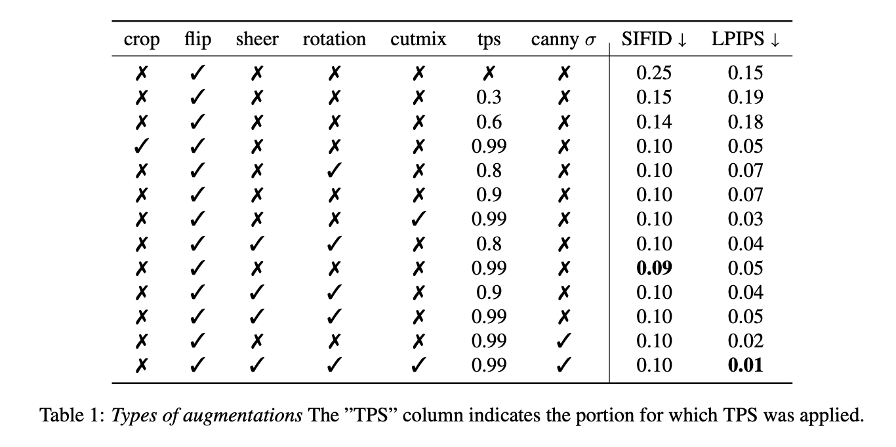
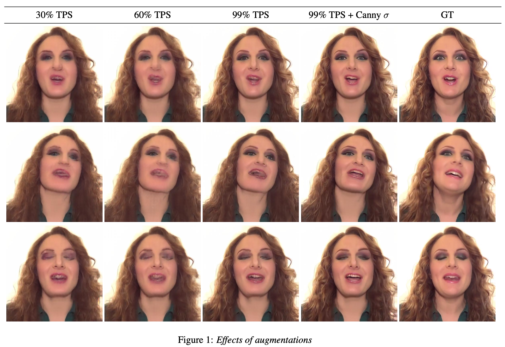
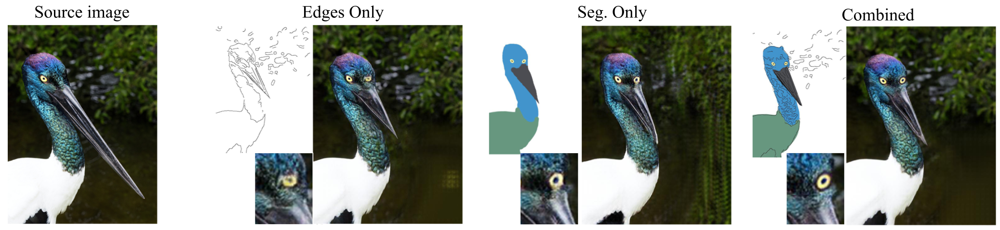
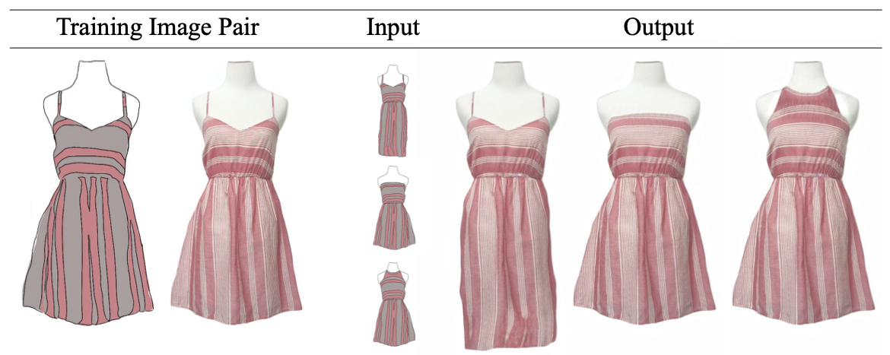

# DeepSIM: Image Shape Manipulation from a Single Augmented Training Sample (ICCV 2021 Oral)
### [Project](http://www.vision.huji.ac.il/deepsim) | [Paper](https://arxiv.org/abs/2109.06151) <br>
Official PyTorch implementation of the paper: "DeepSIM: Image Shape Manipulation from a Single Augmented Training Sample".  


<strong>DeepSIM:</strong> Given a <em>single</em> real training image (b) and a corresponding primitive representation (a), our model learns to map between the primitive (a) to the target image (b). At inference, the original primitive (a) is manipulated by the user. Then, the manipulated primitive is passed through the network which outputs a corresponding manipulated image (e) in the real image domain. 

___


DeepSIM was trained on a <em>single</em> training pair, shown to the left of each sample. First row "face" output- (left) flipping eyebrows, (right) lifting nose. Second row "dog" output- changing shape of dog's hat, removing ribbon, and making face longer. Second row "car" output-  (top) adding wheel, (bottom) conversion to sports car.

___

> **DeepSIM: Image Shape Manipulation from a Single Augmented Training Sample**<br>
> Yael Vinker*, Eliahu Horwitz*, Nir Zabari, Yedid Hoshen<br>
> *Equal contribution<br>
> https://arxiv.org/pdf/2007.01289 <br>
>
>**Abstract:** We present DeepSIM, a generative model for conditional image manipulation based on a single image.
We find that extensive augmentation is key for enabling single image training, and incorporate the use of thin-plate-spline (TPS) as an effective augmentation.
Our network learns to map between a primitive representation of the image to the image itself.
The choice of a primitive representation has an impact on the ease and expressiveness of the manipulations and can be automatic (e.g. edges), manual (e.g. segmentation) or hybrid such as edges on top of segmentations.
At manipulation time, our generator allows for making complex image changes by modifying the primitive input representation and mapping it through the network.
Our method is shown to achieve remarkable performance on image manipulation tasks.


## Getting Started

### Setup 
1.  Clone the repo:
```bash
git clone https://github.com/eliahuhorwitz/DeepSIM.git
cd DeepSIM
```
2. Create a new environment and install the libraries:
```bash
python3.7 -m venv deepsim_venv
source deepsim_venv/bin/activate
pip install -r requirements.txt
```

<br>
<br>

### Training
The input primitive used for training should be specified using --primitive and can be one of the following:
1. "seg" - train using segmentation only
2. "edges" - train using edges only
3. "seg_edges" - train using a combination of edges and segmentation
4. "manual" - could be anything (for example, a painting)

For the chosen option, a suitable input file should be provided under <dataroot>/"train_<primitive>" (e.g. ./datasets/car/train_seg).
For automatic edges, you can leave the "train_edges" folder empty, and an edge map will be generated automatically.
Note that for the segmentation primitive option, you must verify that the input at test time fits exactly the input at train time in terms of colors.  

To train on CPU please specify --gpu_ids '-1'.
- Train DeepSIM on the "face" video using both edges and segmentations (`bash ./scripts/train_face_vid_seg_edges.sh`):
```bash
#!./scripts/train_face_vid_seg_edges.sh
python3.7 ./train.py --dataroot ./datasets/face_video --primitive seg_edges --no_instance --tps_aug 1 --name DeepSIMFaceVideo
```

- Train DeepSIM on the "car" image using segmentation only (`bash ./scripts/train_car_seg.sh`):
```bash
#!./scripts/train_car_seg.sh
python3.7 ./train.py --dataroot ./datasets/car --primitive seg --no_instance --tps_aug 1 --name DeepSIMCar
```

- Train DeepSIM on the "face" image using edges only (`bash ./scripts/train_face_edges.sh`):
```bash
#!./scripts/train_face_edges.sh
python3.7 ./train.py --dataroot ./datasets/face --primitive edges --no_instance --tps_aug 1 --name DeepSIMFace
```


### Testing
- Test DeepSIM on the "face" video using both edges and segmentations (`bash ./scripts/test_face_vid_seg_edges.sh`):
```bash
#!./scripts/test_face_vid_seg_edges.sh
python3.7 ./test.py --dataroot ./datasets/face_video --primitive seg_edges --phase "test" --no_instance --name DeepSIMFaceVideo --vid_mode 1 --test_canny_sigma 0.5
```

- Test DeepSIM on the "car" image using segmentation only (`bash ./scripts/test_car_seg.sh`):
```bash
#!./scripts/test_car_seg.sh
python3.7 ./test.py --dataroot ./datasets/car --primitive seg --phase "test" --no_instance --name DeepSIMCar
```

- Test DeepSIM on the "face" image using edges only (`bash ./scripts/test_face_edges.sh`):
```bash
#!./scripts/test_face_edges.sh
python3.7 ./test.py --dataroot ./datasets/face --primitive edges --phase "test" --no_instance --name DeepSIMFace
```


### Additional Augmentations
As shown in the supplementary, adding augmentations on top of TPS may lead to better results 



- Train DeepSIM on the "face" video using both edges and segmentations with sheer, rotations, "cutmix", and canny sigma augmentations (`bash ./scripts/train_face_vid_seg_edges_all_augmentations.sh`):
```bash
#!./scripts/train_face_vid_seg_edges_all_augmentations.sh
python3.7 ./train.py --dataroot ./datasets/face_video --primitive seg_edges --no_instance --tps_aug 1 --name DeepSIMFaceVideoAugmentations --cutmix_aug 1 --affine_aug "shearx_sheary_rotation" --canny_aug 1
```

- When using edges or seg_edges, it may be beneficial to have white edges instead of black ones, to do so add the ```--canny_color 1``` option
- Check ```./options/base_options.py``` for more augmentation related settings 
- When using edges or seg_edges and adding edges manually at test time, it may be beneficial to apply "skeletonize" (e.g [skimage skeletonize](https://scikit-image.org/docs/dev/auto_examples/edges/plot_skeleton.html) )on the edges in order for them to resemble the canny edges

## More Results

Top row - primitive images. Left - original pair used for training. Center- switching the positions between the two rightmost cars. Right- removing the leftmost car and inpainting the background.

___


The leftmost column shows the source image, then each column demonstrate the result of our model when trained on the specified primitive. We manipulated the image primitives, adding a right eye, changing the point of view and shortening the beak. Our results are presented next to each manipulated primitive. The combined primitive performed best on high-level changes (e.g. the eye), and low-level changes (e.g. the background).

___


On the left is the training image pair, in the middle are the manipulated primitives and on the right are the manipulated outputs- left to right: dress length, strapless, wrap around the neck.

## Single Image Animation 

### Animation to Video


### Video to Animation 


## Citation
If you find this useful for your research, please use the following.

```
@InProceedings{Vinker_2021_ICCV,
    author    = {Vinker, Yael and Horwitz, Eliahu and Zabari, Nir and Hoshen, Yedid},
    title     = {Image Shape Manipulation From a Single Augmented Training Sample},
    booktitle = {Proceedings of the IEEE/CVF International Conference on Computer Vision (ICCV)},
    month     = {October},
    year      = {2021},
    pages     = {13769-13778}
}
```


## Acknowledgments
 - The single image animation primitives were created by Jonathan Reich [jonathanreichandco@gmail.com](mailto:jonathanreichandco@gmail.com)
 - This code borrows from [pix2pixHD](https://github.com/NVIDIA/pix2pixHD).
