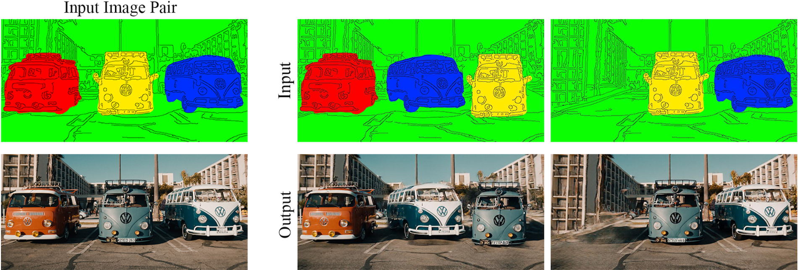
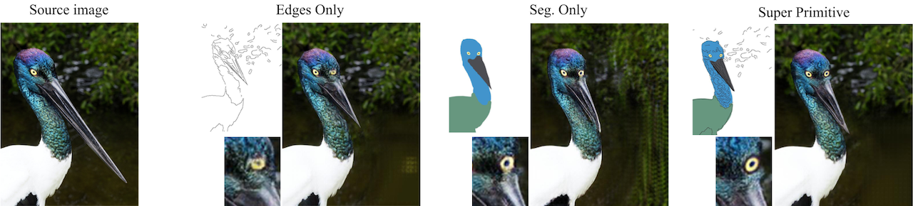
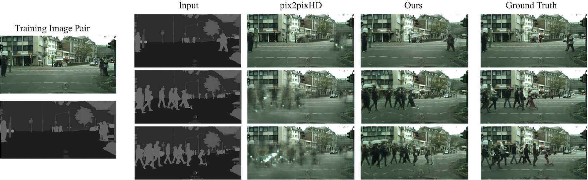

# DeepSIM
### [Project](http://www.vision.huji.ac.il/deepsim) | [Paper](https://arxiv.org/abs/2007.01289) <br>
Official PyTorch implementation of the paper: "Deep Single Image Manipulation".  

## Results

<p align='center'>  
  
</p>

### SuperPrimitive2Image

<p align='center'>
  
</p>
<p align='center'>
  
</p>


### Image2VideoFrames

<p align='center'>
  
</p>


## Getting Started
### Training
- Train a model at 640 x 640 resolution (`bash ./scripts/train.sh`):
```bash
#!./scripts/train.sh
python3.7 train.py --dataroot ./datasets/face --name DeepSIM --niter 8000 --niter_decay 8000 --label_nc 0 --no_instance --tps_aug 1 --apply_binary_threshold 1
```
- To view training results, please checkout intermediate results in `./checkpoints/DeepSIM/web/index.html`.

### Training with your own dataset
- For binary training images (i.e. edge maps) use `--apply_binary_threshold 1`, to ensure that the edges input is indeed binary (during both training and inference), for segmentation maps use `--apply_binary_threshold 0`, you may also use `--edge_threshold` to control the threshold.
- For TPS augmentations use `--tps_aug 1`, this will train the image with a new random TPS warp every epoch.
- See `options/train_options.py` and `options/base_options.py` for all the training flags; see `options/test_options.py` and `options/base_options.py` for all the test flags. See pix2pixHD for further details.
### Testing


- Test the model (`bash ./scripts/test.sh`):
```bash
#!./scripts/test.sh
python3.7 test.py --dataroot ./datasets/face --name DeepSIM --label_nc 0 --no_instance --apply_binary_threshold 1 --tps_aug 0
```
The test results will be saved to a html file here: `./results/DeepSIM/test_latest/index.html`.

More examples can be found in the `scripts` directory.


## Citation

If you find this useful for your research, please use the following.

```
@misc{vinker2020deep,
    title={Deep Single Image Manipulation},
    author={Yael Vinker and Eliahu Horwitz and Nir Zabari and Yedid Hoshen},
    year={2020}, 
    eprint={2007.01289},
    archivePrefix={arXiv},
}
```


## Acknowledgments
This code borrows heavily from [pix2pixHD](https://github.com/NVIDIA/pix2pixHD).
